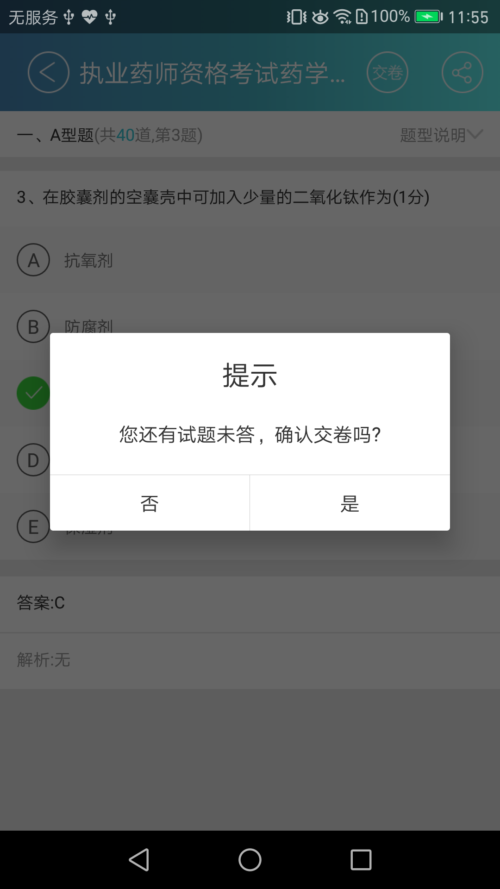
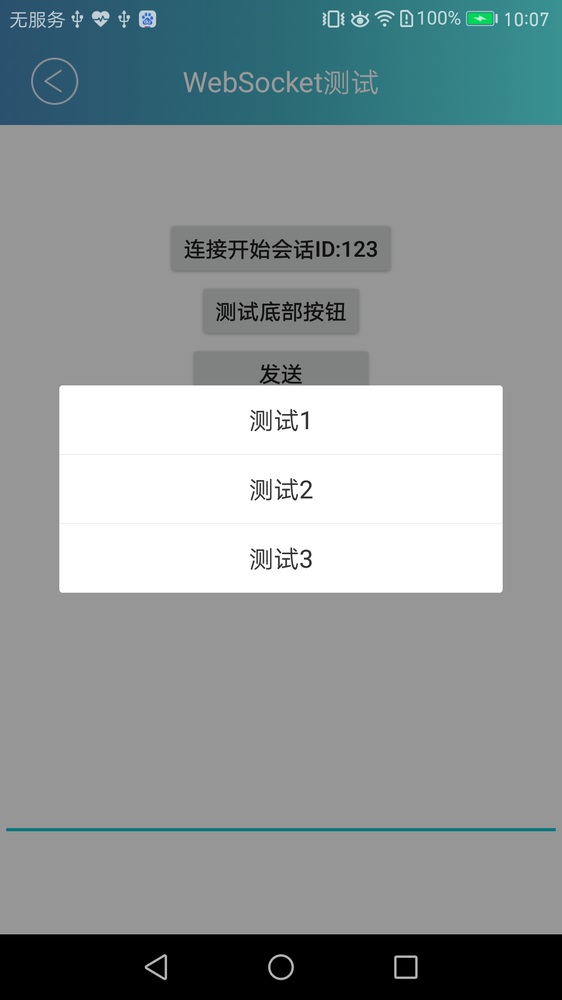
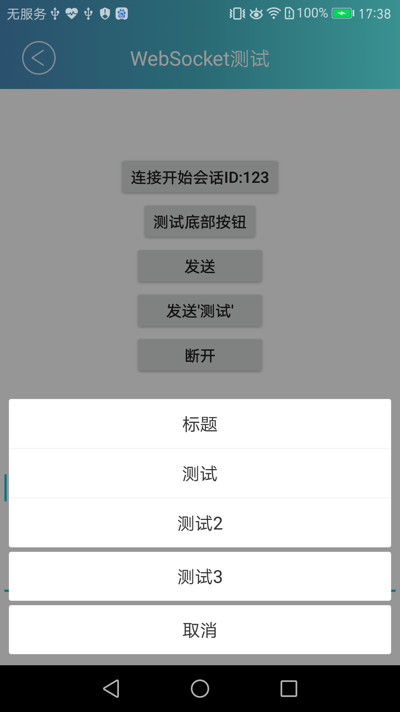

# xywy-ui-library使用说明


## 1 代码结构类

### 1.1 BaseApplication

功能：完成所有Activity的生命周期的监控与管理
代码位置: com/xywy/uilibrary/app/XywyBaseApplication.java
### 1.2 BaseActivity

XywySuperBaseActivity

代码位置: com/xywy/uilibrary/activity/XywySuperBaseActivity.java


### 1.3 BaseFragment

#### 1.3.1 XywySuperBaseFragment
代码位置: com/xywy/uilibrary/fragment/XywySuperBaseFragment.java

#### 1.3.2 ListFragment

##### 1.3.2.1 XywyListFragment
代码位置: com/xywy/uilibrary/fragment/listfragment/XywyListFragment.java

##### 1.3.2.2 XywyPullToRefreshAndLoadMoreFragment
代码位置: com/xywy/uilibrary/fragment/listfragment/XywyPullToRefreshAndLoadMoreFragment.java

#### 1.3.3 XYWYTabPagerFragment
代码位置: com/xywy/uilibrary/fragment/pagerfragment/fragment/XYWYTabPagerFragment.java


--------------------------------

## 2 UI组件类

### 2.1 RecyclerView Adapter

#### 2.1.1 XYWYRVMultiTypeBaseAdapter
代码位置: com/xywy/uilibrary/recyclerview/adapter/XYWYRVMultiTypeBaseAdapter.java

#### 2.1.2 XYWYRVSingleTypeBaseAdapter

代码位置: com/xywy/uilibrary/recyclerview/adapter/XYWYRVSingleTypeBaseAdapter.java


### 2.2 Dialog

#### 2.2.1 XywyPNDialog

通用可自定义的 确认取消Dialog
确认取消按钮都可以自定义按钮文字；
按钮文字可自定义颜色；
可设置只有一个确认按钮；
标题可隐藏，只有内容；

代码位置: com/xywy/uilibrary/dialog/pndialog/XywyPNDialog.java
示例代码：
```
new XywyPNDialog.Builder()
    .setPositiveStr("是")
    .setNegativeStr("否")
    .setContent("您还有试题未答，确认交卷吗?")
    .create(context, new PNDialogListener() {
                @Override
                public void onPositive() {
                    //确认按钮点击事件
                }

                @Override
                public void onNegative() {
                    //TODO取消按钮事件  没有不需要实现

                    }
            });
```




#### 2.2.2 XywyAbsDialog
代码位置: com/xywy/uilibrary/dialog/XywyAbsDialog.java

#### 2.2.3 MiddleListPopupWindow
可自定义item的 屏幕中部显示的 列表Dialog

代码位置: com/xywy/uilibrary/dialog/middlelistpopupwindow/MiddleListPopupWindow.java

使用示例：
```
  new MiddleListPopupWindow.Builder()
                        .addItem("测试1", new BtnClickListener() {
                            @Override
                            public void onItemClick() {
                                shortToast("点击了测试");
                            }
                        })
                        .addItem("测试2", new BtnClickListener() {
                            @Override
                            public void onItemClick() {
                                shortToast("点击了测试2");
                            }
                        })
                        .addItem("测试3", new BtnClickListener() {
                            @Override
                            public void onItemClick() {
                                shortToast("点击了测试3");
                            }
                        }).build(this).show();

```
上述代码显示效果如下图所示


#### 2.2.4 BottomBtnPopupWindow

底部弹起 按钮组组件

代码位置: com/xywy/uilibrary/dialog/bottompopupdialog/BottomBtnPopupWindow.java

使用示例

```
  new BottomBtnPopupWindow.Builder()
                        .addGroupItem("标题",null)//无点击事件传null
                        //添加组Item 会自动分组 组第一个为上部圆角 组最后一个为底部圆角 中部item无圆角
                        .addGroupItem("测试", new BtnClickListener() {
                            @Override
                            public void onItemClick() {
                                shortToast("点击了测试");
                            }
                        })
                        .addGroupItem("测试2", new BtnClickListener() {
                            @Override
                            public void onItemClick() {
                                shortToast("点击了测试2");
                            }
                        })
                        //添加单个item 单个item 四个角均为圆角 并且与其他Item 有4dp的间距
                       .addSingleItem("测试3", new BtnClickListener() {
                            @Override
                            public void onItemClick() {
                                shortToast("点击了测试3");
                            }
                        }).build(this).show();
```
上述代码对应效果如下：


## 3 RX

代码位置: com/xywy/uilibrary/rx/CommonSubscribe.java
CommonSubscribe 可做回调使用


## 其他工具类

Density工具类：
代码位置: com/xywy/uilibrary/utils/DensityUtils.java

键盘工具类：
代码位置: com/xywy/uilibrary/utils/KeyBoardUtils.java

状态栏工具类：
代码位置: com/xywy/uilibrary/utils/StatusBarUtil.java

